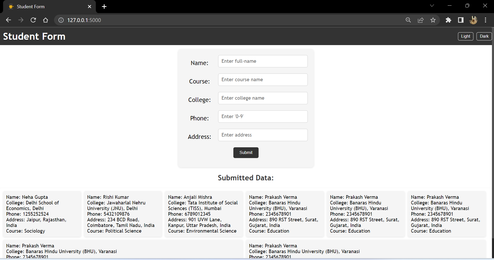
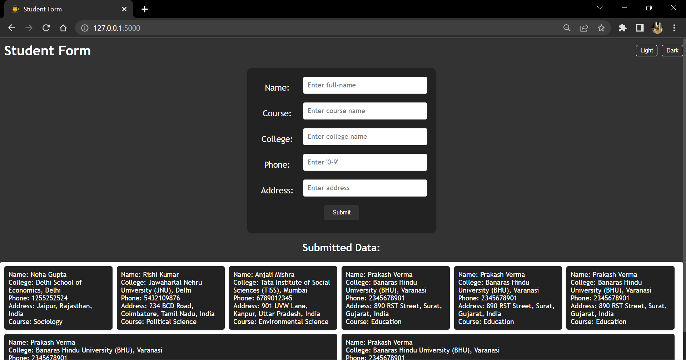

# Student Form

This is a simple web application built using Flask that allows users to submit student information through a form. The submitted data is stored in a SQLite database.




## Installation

1. Clone the repository or download the project files.

2. Create a virtual environment (optional):

   ```bash
   python3 -m venv venv
   source venv/bin/activate
   ```

3. Install the required packages:

   ```bash
   pip install -r requirements.txt
   ```

## Database Setup

1. Initialize the database migration:

   ```bash
   flask db init
   ```

2. Generate the initial migration:

   ```bash
   flask db migrate
   ```

3. Apply the database migrations:

   ```bash
   flask db upgrade
   ```

## Usage

1. Set the environment variables (Windows command prompt):

   ```bash
   set FLASK_APP=app.py
   set FLASK_ENV=production
   set FLASK_DEBUG=1
   ```

2. Start the Flask development server:

   ```bash
   flask run
   ```

3. Open your web browser and go to `http://localhost:5000` to access the application.

4. Fill in the student information in the form and click the "Submit" button.

5. The submitted data will be displayed on the web page.

## Files

- `app.py`: The main Flask application file containing the route definitions and database setup.
- `models.py`: Defines the `Student` model for the database table.
- `index.html`: The HTML template file for the home page.
- `style.css`: The CSS file for styling the HTML template.

## Libraries Used

- Flask: A lightweight web framework for building web applications in Python.
- Flask SQLAlchemy: A Flask extension for using SQLAlchemy, a powerful database toolkit.
- Flask Migrate: A Flask extension for handling database migrations.

## Functions and Methods

- `index()`: The route function for the home page (`/`). Handles both GET and POST requests. When a POST request is received, it validates the form data and stores it in the database.
- `setTheme(theme)`: JavaScript function for switching between light and dark themes.
- `validatePhoneNumber(input)`: JavaScript function for validating the phone number input by removing non-digit characters.

## License

This project is licensed under the MIT License. See the [LICENSE](LICENSE) file for more information.
